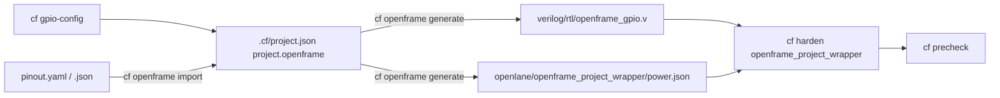

# Openframe flow with cf-cli

This guide covers an `openframe_user_project` from pad configuration to precheck. The GPIO pad modes and
the power domains live in one spec, the `project.openframe` block of `.cf/project.json`. Everything else
is generated from it.



## 1. Initialize

```bash
cf init        # choose type "openframe"; seeds project.openframe from .cf/openframe_default.json
cf setup       # PDK, LibreLane (pinned in versions.json), precheck image
ipm install-dep --ip-root ip   # CF_gpio_config (v1.2.0+ needed for pad overrides)
```

## 2. Configure the pads and power domains

```bash
cf gpio-config           # 44-pad grid
cf gpio-config --view    # print the pinout
```

In the grid: arrows move, `Space` selects, `Enter` edits the selected pads (mode, signal, bit, overrides),
`u` cycles the mode for unlisted pads, `p` edits power domains and macro mappings, `d` validates and saves,
and `q` quits without saving. Saving also regenerates the files below.

To edit by hand or exchange with other tools:

```bash
cf openframe export pinout.yaml
cf openframe import pinout.yaml          # validates, stores, regenerates
cf openframe import pinout.yaml --force  # replace a different existing spec
```

The spec format, validation rules and JSON Schema are described in the README section
"Configure an Openframe Project".

## 3. Generate

```bash
cf openframe generate          # write the generated files
cf openframe generate --check  # exit 1 if any generated file is missing or stale (CI)
```

| File | Content |
|---|---|
| `verilog/rtl/openframe_gpio.v` | One `CF_gpio_config` per pad, with user ports named by the spec. `openframe_project_wrapper.v` instantiates it. |
| `openlane/openframe_project_wrapper/power.json` | `VDD_NETS`, `GND_NETS`, `PDN_MACRO_CONNECTIONS` (LibreLane 3.x) for the wrapper PDN. |

Both files start with the `spec-sha256` of the spec they were generated from. Do not edit them by hand.

## 4. Harden

```bash
cf harden user_proj_timer            # your macros first
cf harden openframe_project_wrapper  # runs: librelane … power.json config.json
```

When a macro directory contains `power.json`, `cf harden` passes it before `config.*` on both the Nix and
Docker backends, exactly like `openlane/Makefile`. LibreLane has no config include and takes `meta` from
the last file, so `config.json` (flow and step reorder) must come last and must not set `VDD_NETS`,
`GND_NETS` or `PDN_MACRO_CONNECTIONS`. If `power.json` is missing, the wrapper PDN fails with an explicit
error instead of guessing nets.

## 5. Precheck

```bash
cf precheck
```

## Out-of-sync warnings

`cf harden openframe_project_wrapper` and `cf precheck` compare the generated files with what
`project.openframe` would generate now. On a mismatch they print a warning panel with one line per file:

| Reason | Meaning |
|---|---|
| `missing` | The file does not exist. |
| `generated from a different spec` | The `spec-sha256` header does not match the current spec (spec edited after generating). |
| `edited by hand since it was generated` | The header matches but the content differs. |
| `not generated by cf openframe generate` | The file has no `spec-sha256` header. |

They also warn when `project.openframe` is missing or invalid (listing the validation errors). The command
still runs with the files on disk. Run `cf openframe generate` to bring them back in sync. Hardening other
macros does not warn, because they do not use the generated files.
